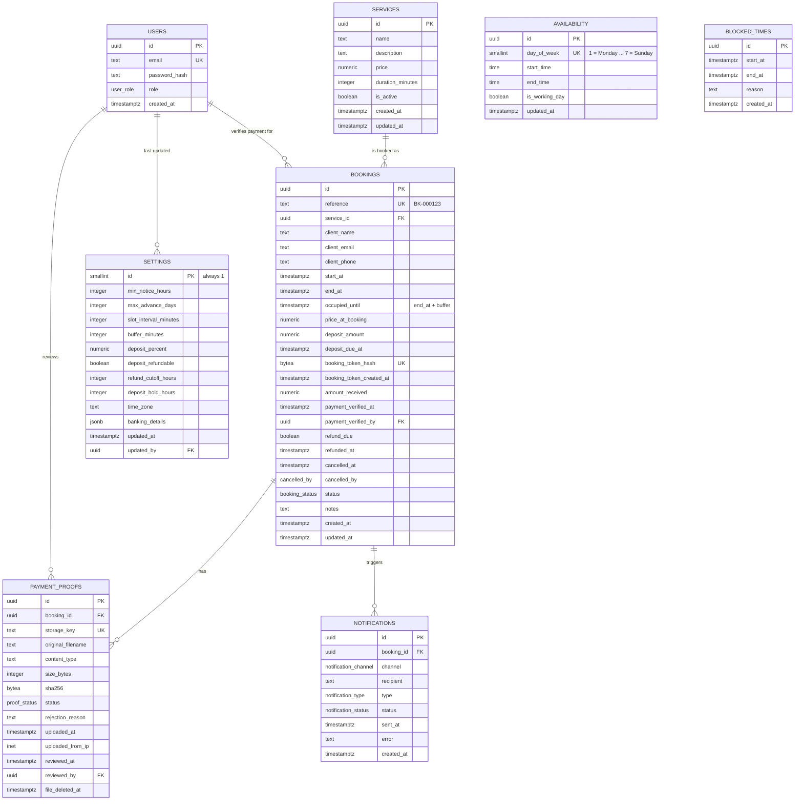

# Database Design

*Service Booking System · PostgreSQL · for [Specification v1.0](Specification.md), section 6*

This document describes every table, column, key, constraint and index in the v1 database, and the reasoning behind them. The reference SQL at the end is the target for the first migration (#19); the ORM or query library (#18) must be able to express it, using raw SQL where needed.

## Contents

1. [Conventions](#1-conventions)
2. [Entity-relationship diagram](#2-entity-relationship-diagram)
3. [Tables](#3-tables)
4. [Preventing double-booking](#4-preventing-double-booking)
5. [Indexes](#5-indexes)
6. [Concurrency and jobs](#6-concurrency-and-jobs)
7. [Data retention](#7-data-retention)
8. [Additions to the specification](#8-additions-to-the-specification)
9. [Reference SQL](#9-reference-sql)

---

## 1. Conventions

| Topic | Rule |
| --- | --- |
| Names | Tables are plural `snake_case` (`blocked_times`); columns are `snake_case` (`client_email`). The application maps them to the `camelCase` names used in the specification (`clientEmail`). |
| Primary keys | `uuid`, generated by the database with `gen_random_uuid()` (built into PostgreSQL 13+). IDs never reveal how many records exist. `settings` is the exception: it has exactly one row. |
| Times | Every point in time is `timestamptz`, stored in UTC (BR-6). Working hours are `time` values interpreted in `settings.time_zone`. |
| Money | `numeric(10,2)` in South African Rand. Never floating point. |
| Enumerations | PostgreSQL `enum` types for fixed sets (booking status, proof status). Adding a value later is a one-line migration. |
| Audit columns | `created_at` on every table; `updated_at` on tables the owner edits. Both default to `now()`. |
| Deleting | Rows that bookings depend on are never deleted: services are deactivated (BR-5), proofs keep their metadata after the file is deleted (BR-14). Foreign keys use `ON DELETE RESTRICT`. |
| Extensions | `btree_gist` (BR-2). v1's exclusion constraint only needs a range, which GiST supports natively, but `btree_gist` lets a future `provider_id` be added to the same constraint with `WITH =`. The first migration enables it (#19). |

## 2. Entity-relationship diagram



`AVAILABILITY` and `BLOCKED_TIMES` have no foreign keys: in v1 they belong to the single provider. When multiple providers are added, each gets a `provider_id`.

## 3. Tables

Unless stated otherwise, every column is `NOT NULL`.

### 3.1 `users`

The administrator account, created by the seed script (#26). There is no sign-up.

| Column | Type | Notes |
| --- | --- | --- |
| `id` | `uuid` | Primary key |
| `email` | `text` | Unique, case-insensitive (unique index on `lower(email)`) |
| `password_hash` | `text` | bcrypt or argon2 hash (#27). The password itself is never stored |
| `role` | `user_role` | Enum: `admin`. More roles can be added later |
| `created_at` | `timestamptz` | |

### 3.2 `services`

| Column | Type | Notes |
| --- | --- | --- |
| `id` | `uuid` | Primary key |
| `name` | `text` | 1 to 100 characters |
| `description` | `text` | Can be empty |
| `price` | `numeric(10,2)` | `>= 0` |
| `duration_minutes` | `integer` | `> 0` and at most 720 (12 hours) |
| `is_active` | `boolean` | Default `true`. Inactive services are hidden from clients and can't be newly booked (BR-5) |
| `created_at`, `updated_at` | `timestamptz` | |

A service with bookings can't be deleted (foreign key `RESTRICT`); `DELETE /admin/services` deactivates it instead (#30).

### 3.3 `availability`

Working hours: one row per day of the week, so exactly seven rows.

| Column | Type | Notes |
| --- | --- | --- |
| `id` | `uuid` | Primary key |
| `day_of_week` | `smallint` | 1 (Monday) to 7 (Sunday), ISO 8601. Unique |
| `start_time` | `time` | Nullable. Local time in `settings.time_zone` |
| `end_time` | `time` | Nullable. Must be after `start_time` |
| `is_working_day` | `boolean` | When `true`, both times are required; when `false`, both are null |
| `updated_at` | `timestamptz` | |

One working window per day matches section 6. A lunch break can be added as a recurring blocked time later, or by allowing several rows per day.

### 3.4 `blocked_times`

Dates or time ranges the owner has blocked (A-6). A whole day is stored as midnight to midnight in the business time zone, converted to UTC.

| Column | Type | Notes |
| --- | --- | --- |
| `id` | `uuid` | Primary key |
| `start_at` | `timestamptz` | |
| `end_at` | `timestamptz` | Must be after `start_at` |
| `reason` | `text` | Nullable. Visible to the owner only |
| `created_at` | `timestamptz` | |

### 3.5 `bookings`

| Column | Type | Notes |
| --- | --- | --- |
| `id` | `uuid` | Primary key. Used in admin URLs only |
| `reference` | `text` | Unique, e.g. `BK-000123`. Generated from a sequence (see below). Shown to the client and used as the EFT payment reference |
| `service_id` | `uuid` | Foreign key to `services`, `RESTRICT` |
| `client_name` | `text` | 1 to 100 characters |
| `client_email` | `text` | Stored as entered; compared in lower case |
| `client_phone` | `text` | Normalised to E.164 (`+27821234567`) before saving, so the booking limit (BR-11) can't be dodged by formatting |
| `start_at` | `timestamptz` | Appointment start |
| `end_at` | `timestamptz` | Appointment end. `end_at - start_at` is the service duration at booking time (BR-4) |
| `occupied_until` | `timestamptz` | `end_at` plus the buffer at booking time (BR-13). The slot is occupied from `start_at` to `occupied_until`. See [section 4](#4-preventing-double-booking) |
| `price_at_booking` | `numeric(10,2)` | Service price at booking time (BR-4) |
| `deposit_amount` | `numeric(10,2)` | `deposit_percent × price_at_booking`, rounded to cents (BR-7). `0` when no deposit applies. Never more than the price |
| `deposit_due_at` | `timestamptz` | Nullable. The deposit deadline (BR-9). Required while Pending; null for bookings that started Confirmed |
| `booking_token_hash` | `bytea` | Nullable. SHA-256 of the booking link token, 32 bytes (BR-15). Unique. Replaced when a new link is issued, so the old link stops working |
| `booking_token_created_at` | `timestamptz` | Nullable. When the current link was issued |
| `amount_received` | `numeric(10,2)` | Nullable. Recorded by the owner when confirming payment (BR-8) |
| `payment_verified_at` | `timestamptz` | Nullable. When the owner confirmed payment |
| `payment_verified_by` | `uuid` | Nullable. Foreign key to `users`: who confirmed payment |
| `refund_due` | `boolean` | Default `false`. Set when a Confirmed booking is cancelled within the refund rule (BR-12). See [section 8](#8-additions-to-the-specification) |
| `refunded_at` | `timestamptz` | Nullable. When the owner recorded the refund as paid (#74) |
| `cancelled_at` | `timestamptz` | Nullable. Required when status is Cancelled |
| `cancelled_by` | `cancelled_by` | Nullable enum: `client`, `admin`. Required when status is Cancelled |
| `status` | `booking_status` | Enum: `pending`, `confirmed`, `completed`, `no_show`, `cancelled`, `expired` (BR-3) |
| `notes` | `text` | Nullable. The client's optional notes, at most 1,000 characters |
| `created_at`, `updated_at` | `timestamptz` | |

**Booking reference.** The default is `'BK-' || lpad(nextval('booking_reference_seq')::text, 6, '0')`. References are unique and increasing; a rolled-back insert leaves a gap in the numbers, which is harmless. The format widens automatically after `BK-999999`.

**Check constraints** keep each row internally consistent, so a bug in the application can't save an impossible booking:

| Constraint | Rule |
| --- | --- |
| Times in order | `start_at < end_at <= occupied_until` |
| Deposit within price | `0 <= deposit_amount <= price_at_booking` |
| Pending has a deadline | `status <> 'pending' OR deposit_due_at IS NOT NULL` |
| Cancellation recorded | `status <> 'cancelled' OR (cancelled_at IS NOT NULL AND cancelled_by IS NOT NULL)` |
| Payment recorded together | `amount_received`, `payment_verified_at` and `payment_verified_by` are all null or all set |
| Refund only when due | `refunded_at IS NULL OR refund_due` |
| Token recorded together | `booking_token_hash` and `booking_token_created_at` are both null or both set |
| Token length | `booking_token_hash IS NULL OR octet_length(booking_token_hash) = 32` |

Which status changes are allowed (BR-3) is enforced in the application's single transition function (#49), not in the database, because the rules depend on who is acting.

### 3.6 `payment_proofs`

| Column | Type | Notes |
| --- | --- | --- |
| `id` | `uuid` | Primary key |
| `booking_id` | `uuid` | Foreign key to `bookings`, `RESTRICT` |
| `storage_key` | `text` | Unique. Random key used by `FileStorage`; never derived from the filename |
| `original_filename` | `text` | As uploaded, at most 255 characters. Shown to the owner only, never used as a path |
| `content_type` | `text` | `application/pdf`, `image/jpeg` or `image/png`, detected from the file's bytes (BR-14) |
| `size_bytes` | `integer` | `> 0` and at most 5,242,880 (5 MB) |
| `sha256` | `bytea` | 32 bytes. Lets the owner spot the same file reused across bookings |
| `status` | `proof_status` | Enum: `received`, `accepted`, `rejected`. Default `received` |
| `rejection_reason` | `text` | Nullable. Required when status is Rejected; shown to the client |
| `uploaded_at` | `timestamptz` | |
| `uploaded_from_ip` | `inet` | Client IP address, for abuse investigation |
| `reviewed_at` | `timestamptz` | Nullable. Set with `reviewed_by` when the owner accepts or rejects |
| `reviewed_by` | `uuid` | Nullable. Foreign key to `users` |
| `file_deleted_at` | `timestamptz` | Nullable. Set when the retention job deletes the file; the row is kept (BR-14) |

**Check constraints:** rejected proofs have a reason; `reviewed_at` and `reviewed_by` are set together, and only once the status is no longer `received`.

The limit of 3 proofs per booking is enforced in the application under a row lock (see [section 6](#6-concurrency-and-jobs)), because a check constraint can't count rows.

### 3.7 `notifications`

One row per message sent or attempted (section 7 of the spec). A failed send is recorded here and never rolls back the booking.

| Column | Type | Notes |
| --- | --- | --- |
| `id` | `uuid` | Primary key |
| `booking_id` | `uuid` | Foreign key to `bookings`, `RESTRICT`. Every v1 message is about a booking |
| `channel` | `notification_channel` | Enum: `email`, `sms` (SMS deferred) |
| `recipient` | `text` | Email address or phone number the message went to |
| `type` | `notification_type` | Enum, listed below |
| `status` | `notification_status` | Enum: `pending`, `sent`, `failed`. Default `pending` |
| `sent_at` | `timestamptz` | Nullable. Set when the provider accepts the message |
| `error` | `text` | Nullable. Provider error, when `failed` |
| `created_at` | `timestamptz` | |

`notification_type` values, from the messages in spec section 7:

| Value | Recipient | Sent when |
| --- | --- | --- |
| `payment_instructions` | Client | A Pending booking is created, or a new booking link is issued while Pending |
| `booking_confirmed` | Client | Payment is confirmed, or a 0% deposit booking is created |
| `proof_rejected` | Client | The owner rejects a proof |
| `booking_cancelled` | Client | The client or the owner cancels |
| `booking_expired` | Client | The expiry job expires the booking |
| `admin_new_booking` | Owner | Any booking is created |
| `admin_proof_uploaded` | Owner | A proof is uploaded |
| `admin_client_cancelled` | Owner | The client cancels (flagged when a refund is due) |

### 3.8 `settings`

A single row (`id = 1`, enforced by a check constraint) read by the other modules (#28). The default values are the reference business's (Make Up by Glory).

| Column | Type | Default | Rule |
| --- | --- | --- | --- |
| `id` | `smallint` | `1` | Always 1 |
| `min_notice_hours` | `integer` | 24 | `>= 0` (BR-10) |
| `max_advance_days` | `integer` | 90 | `> 0` (BR-10) |
| `slot_interval_minutes` | `integer` | 120 | `> 0` (BR-13; see open question 1) |
| `buffer_minutes` | `integer` | 60 | `>= 0` (BR-13) |
| `deposit_percent` | `numeric(5,2)` | to be confirmed in #28 | 0 to 100 (BR-7). 0 means no deposit |
| `deposit_refundable` | `boolean` | `true` | (BR-12) |
| `refund_cutoff_hours` | `integer` | 24 | `>= 0` (BR-12) |
| `deposit_hold_hours` | `integer` | 24 | `> 0` (BR-9) |
| `time_zone` | `text` | `Africa/Johannesburg` | An IANA time zone name, validated by the application (BR-6) |
| `banking_details` | `jsonb` | | Object with `accountName`, `bank`, `accountNumber`, `branchCode`, `accountType`. Shown to clients in the payment instructions |
| `updated_at` | `timestamptz` | `now()` | |
| `updated_by` | `uuid` | | Nullable. Foreign key to `users` |

Changing a setting affects new bookings only: each booking already stores its own price, deposit, deadline and occupied time.

## 4. Preventing double-booking

BR-2 requires that two simultaneous requests for overlapping times give exactly one success. Checking availability in the application first isn't enough on its own: two requests can both check, both see a free slot, and both insert. The database therefore enforces it with an **exclusion constraint**:

```sql
ALTER TABLE bookings
  ADD CONSTRAINT bookings_no_overlap
  EXCLUDE USING gist (tstzrange(start_at, occupied_until, '[)') WITH &&)
  WHERE (status IN ('pending', 'confirmed'));
```

How it works:

- **The range.** `tstzrange(start_at, occupied_until, '[)')` is the time the booking occupies: the appointment plus the buffer after it (BR-13). `[)` means the start is included and the end is not, so a booking ending at 12:00 doesn't clash with one starting at 12:00.
- **The operator.** `&&` means "overlaps". PostgreSQL refuses to insert or update a row whose range overlaps the range of any other row the constraint covers.
- **The condition.** Only Pending and Confirmed bookings count. Cancelled and Expired bookings free their slot immediately; Completed and No-show bookings are in the past.
- **Concurrency.** The check happens inside PostgreSQL with the proper locking, so of two simultaneous overlapping inserts, one succeeds and the other fails, whatever the timing. This is what the concurrency test (#53) proves.
- **The error.** A violation raises SQLSTATE `23P01` (`exclusion_violation`) on `bookings_no_overlap`. The bookings module maps it to `409 Conflict` with a friendly "this time has just been booked" message (#43).

**Why `occupied_until` is stored.** The buffer is a setting that can change. If the constraint calculated `end_at + buffer` from the current setting, changing the buffer would silently change which existing bookings clash. Storing `occupied_until` when the booking is made fixes each booking's footprint, in the same way BR-4 fixes its price and duration. (A generated column isn't possible here either: adding an interval to a `timestamptz` isn't an immutable expression in PostgreSQL.)

**What it doesn't cover.** Blocked times live in another table, so the constraint can't see them. They are checked in the slot calculation and re-checked at submission (#45); the remaining risk is the owner blocking time at the same moment a client books, which she can resolve by cancelling.

## 5. Indexes

Primary keys and unique constraints create their own indexes. The table below lists every index and the query it serves.

| Table | Index | Kind | Serves |
| --- | --- | --- | --- |
| `users` | `lower(email)` | Unique | Admin login (#27) |
| `bookings` | `reference` | Unique | **Booking reference lookup** `GET /bookings/:reference` (C-6), and finding a booking from an EFT reference |
| `bookings` | `booking_token_hash` | Unique, partial (`WHERE booking_token_hash IS NOT NULL`) | **Booking link lookup** `GET /booking/:token`: hash the token from the URL, then find the row (BR-15) |
| `bookings` | `tstzrange(start_at, occupied_until)` | GiST, partial (Pending and Confirmed), created by `bookings_no_overlap` | Overlap check, and the slot calculation's "which bookings overlap this day" query |
| `bookings` | `service_id` | B-tree | Foreign key; "does this service have bookings" before deactivating |
| `bookings` | `start_at` | B-tree | Admin bookings list, dashboard, calendar (A-2, A-3, A-7) |
| `bookings` | `deposit_due_at` | B-tree, partial (`WHERE status = 'pending'`) | Expiry job: Pending bookings past their deadline (BR-9) |
| `bookings` | `lower(client_email)` | B-tree, partial (`WHERE status = 'pending'`) | Booking limit: active Pending bookings per email (BR-11) |
| `bookings` | `client_phone` | B-tree, partial (`WHERE status = 'pending'`) | Booking limit: active Pending bookings per phone (BR-11) |
| `bookings` | `created_at` | B-tree, partial (`WHERE refund_due AND refunded_at IS NULL`) | Dashboard "refunds due" (A-2) |
| `blocked_times` | `tstzrange(start_at, end_at)` | GiST | Slot calculation: blocked periods overlapping a day |
| `payment_proofs` | `booking_id` | B-tree | Proofs for a booking; counting toward the limit of 3 |
| `payment_proofs` | `sha256` | B-tree | Spotting the same file used for different bookings |
| `payment_proofs` | `uploaded_at` | B-tree, partial (`WHERE status = 'received'`) | Dashboard "proofs awaiting review", filter "proof received" (A-2, A-3) |
| `payment_proofs` | `storage_key` | Unique | Storage lookups |
| `payment_proofs` | `uploaded_at` | B-tree, partial (`WHERE file_deleted_at IS NULL`) | Retention job: files not yet deleted (BR-14) |
| `notifications` | `booking_id` | B-tree | Notification history for a booking |

## 6. Concurrency and jobs

| Operation | How it stays correct |
| --- | --- |
| Two clients book overlapping slots | `bookings_no_overlap` (section 4). |
| Third Pending booking for the same email or phone (BR-11) | In the booking transaction: count active Pending bookings for the email and phone, then insert. To stop two simultaneous bookings from both passing the count, the transaction first takes a transaction-scoped advisory lock on the normalised email and on the phone (`pg_advisory_xact_lock(hashtext(...))`). |
| Parallel uploads to one booking (limit of 3, section 10 of the spec) | The upload transaction locks the booking row (`SELECT ... FROM bookings WHERE id = $1 FOR UPDATE`), re-checks the status is Pending, counts the proofs, inserts the new row, then commits. A second upload waits for the lock and sees the new count. |
| Expiry job (BR-9) | One conditional statement: `UPDATE bookings SET status = 'expired', updated_at = now() WHERE status = 'pending' AND deposit_due_at < now() RETURNING id`. Running it twice, or alongside the owner confirming payment, never expires a booking that was confirmed first. The returned IDs drive the expiry emails. |
| Confirm payment, cancel, extend deadline | Each is an `UPDATE ... WHERE id = $1 AND status = <expected status>`. If no row is updated, the status changed in the meantime and the request returns `409 Conflict`. |
| New booking link (BR-15) | Overwrites `booking_token_hash` in one statement, so exactly one link works at any time. |

## 7. Data retention

| Data | Kept for | Mechanism |
| --- | --- | --- |
| Proof-of-payment files | 90 days after the booking reaches a terminal status | Daily job deletes the file through `FileStorage` and sets `file_deleted_at` (BR-14, #77). The row's metadata stays for the audit trail. |
| Bookings, proofs (metadata), notifications | Not deleted in v1 | Retention for the remaining personal data is decided in the security and POPIA review (#85). |

## 8. Additions to the specification

This design adds two columns to the `Booking` fields in spec section 6, which has been updated to match:

| Column | Why |
| --- | --- |
| `occupied_until` | The exclusion constraint needs each booking's full footprint (duration plus buffer) stored at booking time. See [section 4](#4-preventing-double-booking). |
| `refund_due` | The dashboard's "refunds due" (A-2) and the owner's refund notification (BR-12) need to know, at cancellation time, whether a refund is owed. Working it out later from the current refund settings would give the wrong answer after the owner changes them. |

It also fixes some details the specification leaves open: UUID primary keys, ISO day-of-week numbering, E.164 phone numbers, the `banking_details` structure, the list of notification types, and the `pending`/`sent`/`failed` notification statuses.

## 9. Reference SQL

The target schema for the first migration (#19). It runs on PostgreSQL 13 or later.

```sql
CREATE EXTENSION IF NOT EXISTS btree_gist;

-- Types

CREATE TYPE user_role AS ENUM ('admin');
CREATE TYPE booking_status AS ENUM ('pending', 'confirmed', 'completed', 'no_show', 'cancelled', 'expired');
CREATE TYPE cancelled_by AS ENUM ('client', 'admin');
CREATE TYPE proof_status AS ENUM ('received', 'accepted', 'rejected');
CREATE TYPE notification_channel AS ENUM ('email', 'sms');
CREATE TYPE notification_status AS ENUM ('pending', 'sent', 'failed');
CREATE TYPE notification_type AS ENUM (
  'payment_instructions', 'booking_confirmed', 'proof_rejected', 'booking_cancelled', 'booking_expired',
  'admin_new_booking', 'admin_proof_uploaded', 'admin_client_cancelled'
);

-- Users

CREATE TABLE users (
  id            uuid PRIMARY KEY DEFAULT gen_random_uuid(),
  email         text NOT NULL,
  password_hash text NOT NULL,
  role          user_role NOT NULL DEFAULT 'admin',
  created_at    timestamptz NOT NULL DEFAULT now()
);
CREATE UNIQUE INDEX users_email_key ON users (lower(email));

-- Services

CREATE TABLE services (
  id               uuid PRIMARY KEY DEFAULT gen_random_uuid(),
  name             text NOT NULL CHECK (char_length(name) BETWEEN 1 AND 100),
  description      text NOT NULL DEFAULT '',
  price            numeric(10,2) NOT NULL CHECK (price >= 0),
  duration_minutes integer NOT NULL CHECK (duration_minutes > 0 AND duration_minutes <= 720),
  is_active        boolean NOT NULL DEFAULT true,
  created_at       timestamptz NOT NULL DEFAULT now(),
  updated_at       timestamptz NOT NULL DEFAULT now()
);

-- Availability

CREATE TABLE availability (
  id             uuid PRIMARY KEY DEFAULT gen_random_uuid(),
  day_of_week    smallint NOT NULL UNIQUE CHECK (day_of_week BETWEEN 1 AND 7),
  start_time     time,
  end_time       time,
  is_working_day boolean NOT NULL,
  updated_at     timestamptz NOT NULL DEFAULT now(),
  CONSTRAINT availability_hours CHECK (
    (is_working_day AND start_time IS NOT NULL AND end_time IS NOT NULL AND end_time > start_time)
    OR (NOT is_working_day AND start_time IS NULL AND end_time IS NULL)
  )
);

-- Blocked times

CREATE TABLE blocked_times (
  id         uuid PRIMARY KEY DEFAULT gen_random_uuid(),
  start_at   timestamptz NOT NULL,
  end_at     timestamptz NOT NULL,
  reason     text,
  created_at timestamptz NOT NULL DEFAULT now(),
  CONSTRAINT blocked_times_order CHECK (end_at > start_at)
);
CREATE INDEX blocked_times_range_idx ON blocked_times USING gist (tstzrange(start_at, end_at, '[)'));

-- Bookings

CREATE SEQUENCE booking_reference_seq;

CREATE TABLE bookings (
  id                       uuid PRIMARY KEY DEFAULT gen_random_uuid(),
  reference                text NOT NULL UNIQUE
                             DEFAULT 'BK-' || lpad(nextval('booking_reference_seq')::text, 6, '0'),
  service_id               uuid NOT NULL REFERENCES services (id) ON DELETE RESTRICT,
  client_name              text NOT NULL CHECK (char_length(client_name) BETWEEN 1 AND 100),
  client_email             text NOT NULL,
  client_phone             text NOT NULL,
  start_at                 timestamptz NOT NULL,
  end_at                   timestamptz NOT NULL,
  occupied_until           timestamptz NOT NULL,
  price_at_booking         numeric(10,2) NOT NULL,
  deposit_amount           numeric(10,2) NOT NULL,
  deposit_due_at           timestamptz,
  booking_token_hash       bytea,
  booking_token_created_at timestamptz,
  amount_received          numeric(10,2),
  payment_verified_at      timestamptz,
  payment_verified_by      uuid REFERENCES users (id) ON DELETE RESTRICT,
  refund_due               boolean NOT NULL DEFAULT false,
  refunded_at              timestamptz,
  cancelled_at             timestamptz,
  cancelled_by             cancelled_by,
  status                   booking_status NOT NULL,
  notes                    text CHECK (char_length(notes) <= 1000),
  created_at               timestamptz NOT NULL DEFAULT now(),
  updated_at               timestamptz NOT NULL DEFAULT now(),

  CONSTRAINT bookings_times_order CHECK (start_at < end_at AND end_at <= occupied_until),
  CONSTRAINT bookings_deposit_range CHECK (deposit_amount >= 0 AND deposit_amount <= price_at_booking),
  CONSTRAINT bookings_pending_deadline CHECK (status <> 'pending' OR deposit_due_at IS NOT NULL),
  CONSTRAINT bookings_cancellation CHECK (
    status <> 'cancelled' OR (cancelled_at IS NOT NULL AND cancelled_by IS NOT NULL)
  ),
  CONSTRAINT bookings_payment_together CHECK (
    (amount_received IS NULL AND payment_verified_at IS NULL AND payment_verified_by IS NULL)
    OR (amount_received IS NOT NULL AND payment_verified_at IS NOT NULL AND payment_verified_by IS NOT NULL)
  ),
  CONSTRAINT bookings_refund_when_due CHECK (refunded_at IS NULL OR refund_due),
  CONSTRAINT bookings_token_together CHECK ((booking_token_hash IS NULL) = (booking_token_created_at IS NULL)),
  CONSTRAINT bookings_token_length CHECK (booking_token_hash IS NULL OR octet_length(booking_token_hash) = 32),

  CONSTRAINT bookings_no_overlap
    EXCLUDE USING gist (tstzrange(start_at, occupied_until, '[)') WITH &&)
    WHERE (status IN ('pending', 'confirmed'))
);

ALTER SEQUENCE booking_reference_seq OWNED BY bookings.reference;

CREATE UNIQUE INDEX bookings_token_hash_key ON bookings (booking_token_hash) WHERE booking_token_hash IS NOT NULL;
CREATE INDEX bookings_service_id_idx ON bookings (service_id);
CREATE INDEX bookings_start_at_idx ON bookings (start_at);
CREATE INDEX bookings_pending_deadline_idx ON bookings (deposit_due_at) WHERE status = 'pending';
CREATE INDEX bookings_pending_email_idx ON bookings (lower(client_email)) WHERE status = 'pending';
CREATE INDEX bookings_pending_phone_idx ON bookings (client_phone) WHERE status = 'pending';
CREATE INDEX bookings_refunds_due_idx ON bookings (created_at) WHERE refund_due AND refunded_at IS NULL;

-- Payment proofs

CREATE TABLE payment_proofs (
  id                uuid PRIMARY KEY DEFAULT gen_random_uuid(),
  booking_id        uuid NOT NULL REFERENCES bookings (id) ON DELETE RESTRICT,
  storage_key       text NOT NULL UNIQUE,
  original_filename text NOT NULL CHECK (char_length(original_filename) BETWEEN 1 AND 255),
  content_type      text NOT NULL CHECK (content_type IN ('application/pdf', 'image/jpeg', 'image/png')),
  size_bytes        integer NOT NULL CHECK (size_bytes > 0 AND size_bytes <= 5242880),
  sha256            bytea NOT NULL CHECK (octet_length(sha256) = 32),
  status            proof_status NOT NULL DEFAULT 'received',
  rejection_reason  text,
  uploaded_at       timestamptz NOT NULL DEFAULT now(),
  uploaded_from_ip  inet NOT NULL,
  reviewed_at       timestamptz,
  reviewed_by       uuid REFERENCES users (id) ON DELETE RESTRICT,
  file_deleted_at   timestamptz,

  CONSTRAINT payment_proofs_rejection_reason CHECK (status <> 'rejected' OR rejection_reason IS NOT NULL),
  CONSTRAINT payment_proofs_review CHECK (
    (status = 'received' AND reviewed_at IS NULL AND reviewed_by IS NULL)
    OR (status <> 'received' AND reviewed_at IS NOT NULL AND reviewed_by IS NOT NULL)
  )
);
CREATE INDEX payment_proofs_booking_id_idx ON payment_proofs (booking_id);
CREATE INDEX payment_proofs_sha256_idx ON payment_proofs (sha256);
CREATE INDEX payment_proofs_awaiting_review_idx ON payment_proofs (uploaded_at) WHERE status = 'received';
CREATE INDEX payment_proofs_file_retained_idx ON payment_proofs (uploaded_at) WHERE file_deleted_at IS NULL;

-- Notifications

CREATE TABLE notifications (
  id         uuid PRIMARY KEY DEFAULT gen_random_uuid(),
  booking_id uuid NOT NULL REFERENCES bookings (id) ON DELETE RESTRICT,
  channel    notification_channel NOT NULL DEFAULT 'email',
  recipient  text NOT NULL,
  type       notification_type NOT NULL,
  status     notification_status NOT NULL DEFAULT 'pending',
  sent_at    timestamptz,
  error      text,
  created_at timestamptz NOT NULL DEFAULT now()
);
CREATE INDEX notifications_booking_id_idx ON notifications (booking_id);

-- Settings

CREATE TABLE settings (
  id                    smallint PRIMARY KEY DEFAULT 1 CHECK (id = 1),
  min_notice_hours      integer NOT NULL DEFAULT 24 CHECK (min_notice_hours >= 0),
  max_advance_days      integer NOT NULL DEFAULT 90 CHECK (max_advance_days > 0),
  slot_interval_minutes integer NOT NULL DEFAULT 120 CHECK (slot_interval_minutes > 0),
  buffer_minutes        integer NOT NULL DEFAULT 60 CHECK (buffer_minutes >= 0),
  deposit_percent       numeric(5,2) NOT NULL CHECK (deposit_percent BETWEEN 0 AND 100),
  deposit_refundable    boolean NOT NULL DEFAULT true,
  refund_cutoff_hours   integer NOT NULL DEFAULT 24 CHECK (refund_cutoff_hours >= 0),
  deposit_hold_hours    integer NOT NULL DEFAULT 24 CHECK (deposit_hold_hours > 0),
  time_zone             text NOT NULL DEFAULT 'Africa/Johannesburg',
  banking_details       jsonb NOT NULL CHECK (jsonb_typeof(banking_details) = 'object'),
  updated_at            timestamptz NOT NULL DEFAULT now(),
  updated_by            uuid REFERENCES users (id) ON DELETE RESTRICT
);
```
